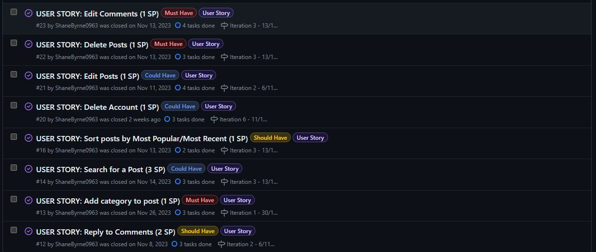
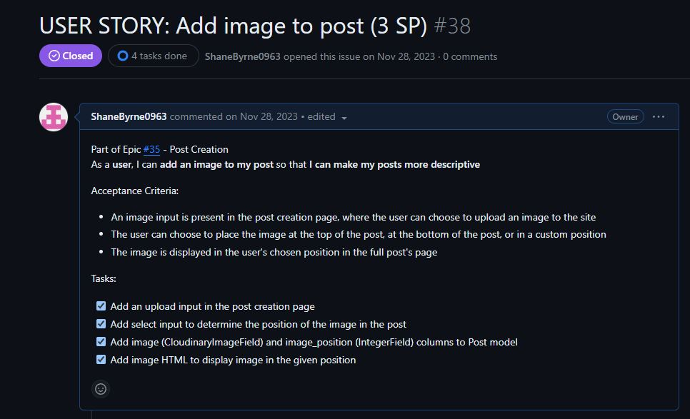
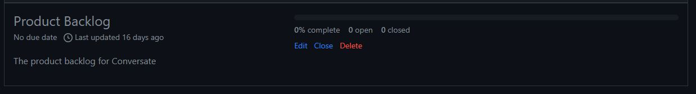
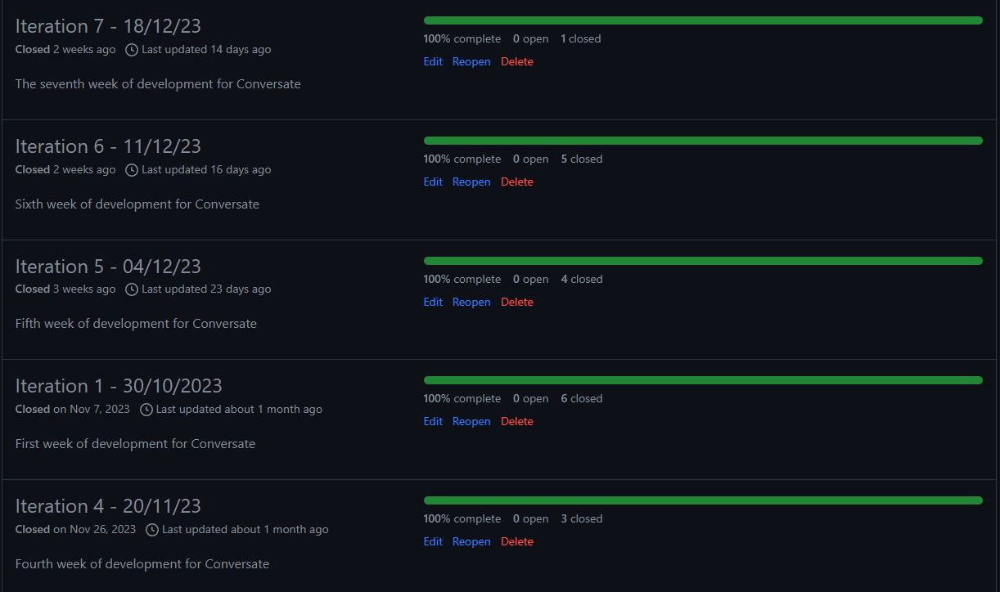

# Conversate&#46;com

## Introduction

Conversate&#46;com is a forum website where people can connect with each other by writing posts, uploading images and creating polls for other people to vote on. The aim of this website is to provide a platform that gives its users a wide range of ways to express their thoughts and opinions, as well as making those expressions as accessible to other users as possible. Conversate was made using the Django framework and designed using Bootstrap

## Design Thinking Process

> *"Why would a user want to visit our website?"*

- To discover information easily and efficiently
- To share their information with the world
- To interact with a community that relates to them

> *"How do we want our users to feel while using our website?"*

- Encouraged to interact with the community

### Problem Statement

> *"How can we make information easy to share and access for everyone?"*

### Solutions

> *"Why would a user want to visit our website?"*

- **To discover information easily and efficiently**
  - Upon logging in to the site, users are introduced to the site's home page, where they can explore a wide range of posts the site has to offer. Having every kind of post available on the home page can help newcomers who are unsure about what they are looking for discover the kind of content that best suits them.
  - If users are looking for something a little more specific, they have an option to search for posts using keywords.
  - Posts can be sorted by "Popular" (Highest number of likes) or "New" (Most recently posted)
- **To share their information with the world**
  - Users can create posts, upload images and ask questions through the use of polls.
  - Posts can be customized using a wide selection of styles, allowing the creators to add headings, divide their content into paragraphs, include lists and tables, and add links to other pages.
- **To interact with a community that relates to them**
  - Posts can have a category assigned to them. Users that are searching for a particular type of post can explore these categories and discover a community that is also interested in this topic.

> *"How do we want our users to feel while using our website?"*

- **Encouraged to interact with the community**
  - Users are required to be logged in to navigate through the majority of the website, which means if they discover a post that interests them they will always have the opportunity to like and comment on that post, as well as vote in polls they discover.

## Features

## Design

### User Interface

### Color Scheme

### Typography

### Wireframes

## Agile Methodologies

This website was completed using an agile development system.

- Each feature was broken down into user stories, which are comprised of the following:
  - A set of acceptance criteria to know when the feature is complete
  - Tasks to achieve in order to implement it
  - Story points to give an estimate on how long it will take to complete.
  - An epic which groups similar user stories together

- Once finalized, these user stories were transferred to the product backlog, which was where all incomplete user stories that were not being worked on were kept.

- The work done was divided into week-long iterations, with a total of 7 iterations occuring to implement all the features in the website.
  - For each iteration, I added a set of user stories which I was to complete within the week, taken from the product backlog, with the aim of having the total story point number resting between 8 and 10 story points
  - Each user story was given a label:
    - "Must Have", given to user stories that must be completed within the iteration timeframe
    - "Should Have", given to user stories that don't have to be completed for this iteration, but should if possible
    - "Could Have", which are user stories that can be completed if all other user stories are finished
  - For each iteration, no more than 60% of all of its user stories were labelled with "Must have"
  - If user stories were still remaining once an iteration came to a close, they were returned to the product backlog, where they could be selected for future iterations

## Data Models

## Testing

### Bugs

### Manual Testing

### Automated Testing

### Browser Testing

## Validation

### W3C HTML

### W3C CSS

### JSHint

### PEP8

### Lighthouse Page Loading

### WebAIM Color Contrast

## Deployment and Local Development

### Deployment to Heroku

### Cloning Repositories

### Forking Repositories

## Credits

### Libraries/Tutorials

### Media
