# Conversate&#46;com

## Introduction

Conversate&#46;com is a forum website where people can connect with each other
by writing posts, uploading images and creating polls for other people to vote
on. The aim of this website is to provide a platform that gives its users a
wide range of ways to express their thoughts and opinions, as well as making
those expressions as accessible to other users as possible. Conversate was made
using the Django framework and designed using Bootstrap

## Design Thinking Process

> *"Why would a user want to visit our website?"*

- To discover information easily and efficiently
- To share their information with the world
- To interact with a community that relates to them

> *"How do we want our users to feel while using our website?"*

- Encouraged to interact with the community

### Problem Statement

> *"How can we make information easy to share and access for everyone?"*

### Solutions

> *"Why would a user want to visit our website?"*

- **To discover information easily and efficiently**
  - Upon logging in to the site, users are introduced to the site's home page,
where they can explore a wide range of posts the site has to offer. Having
every kind of post available on the home page can help newcomers who are unsure
about what they are looking for discover the kind of content that best suits
them.
  - If users are looking for something a little more specific, they have an
option to search for posts using keywords.
  - Posts can be sorted by "Popular" (Highest number of likes) or "New"
(Most recently posted)
- **To share their information with the world**
  - Users can create posts, upload images and ask questions through the use
of polls.
  - Posts can be customized using a wide selection of styles, allowing the
creators to add headings, divide their content into paragraphs, include lists,
and add links to other pages.
- **To interact with a community that relates to them**
  - Posts can have a category assigned to them. Users that are searching for a
particular type of post can explore these categories and discover a community
that is also interested in this topic.

> *"How do we want our users to feel while using our website?"*

- **Encouraged to interact with the community**
  - Users are required to be logged in to navigate through the majority of the
website, which means if they discover a post that interests them they will
always have the opportunity to like and comment on that post, as well as vote
in polls they discover.

## Features

- **Posts**
  - Posts are the main attraction to Conversate. They are blocks of text
created by users to send their thoughts out to the world for all to see. 
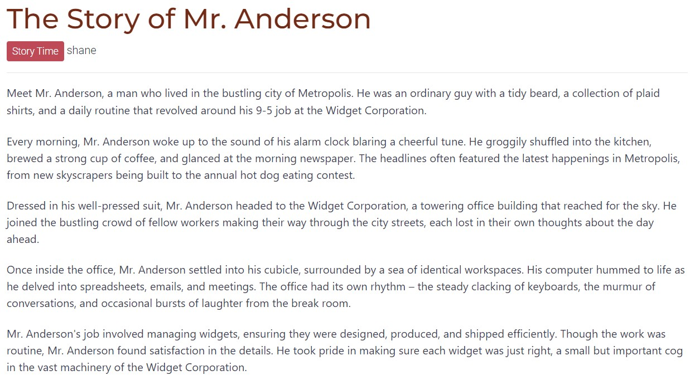
  - All posts are made up of a title and a main body of text. The site uses
Summernote's text editor to give users the ability to add style to their posts.
They can add headings, paragraphs, bullet points, links and horizontal rules.
Text can also be styled in a number of ways, including changing the font size
and setting the font to bold, italics or underlined

  - Categories can be added to a post in order to group it with other posts of
a similar nature. There are a selection of categories created by the site
administrators that can be chosen from
  - Images can also be added to a post. A picture is worth a thousand words,
so adding one can add an invaluable layer of depth to the story the poster is
trying to tell. Images can be placed above or below the main body of text 

  - Posts can be tagged with a list of keywords. These tags can be clicked on,
revealing all posts that also have this tag. Using hashtags can increase the
likelihood of the post to be seen, as it provides an extra method for posts to
be queried
  - Users can choose to like posts to show appreciation to the poster. Posts
with more likes are more likely to be found by exploring users. Posters
cannot like their own posts

- **Comments**
  - Users can comment on posts to share thoughts or add insight of their own
  - If a user sees a comment they appreciate, they can like that comment
    
  - Comments can also be replied to so that a conversation can be started with the commenter. Replies can be replied to in a similar manner
    
- **Polls**
  - Polls are an excellent way to collect answers and gather statistics from the site's community. They are made up of a question (title), a list of between 2 and 5 answers, and an end date.
    
  - Polls can be included within a post, giving the user the ability to add more context to the poll, as well as allowing people to respond in the comments
    
  - Users can only vote for one answer in the list, and once they vote on their decision, they are unable to change their vote
  - Answers from other users cannot be seen until the user has voted, in order to prevent people from only selecting the most popular vote
    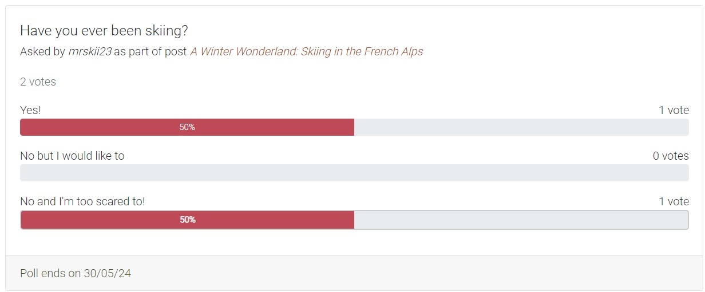
  - Once a poll has passed its due date, votes will no longer be accepted and the final results will be shown
    
- **The Home Page**
  - When the user first logs in to Conversate, the home page is the first step on their journey.
  - They are welcomed with any possible kind of post made, allowing them to explore a wide variety of content until they find something that interests them.
    
- **Categories**
  - If users are looking for something a little more specific, they can search for posts by what category they belong to.
  - A list of categories is present within the navigation that shows the categories with the most posts, making more content easily available to the user
    
    
- **Search Posts**
  - For users that are specifically looking for posts that contain certain words or phrases, they can use the search bar and find those posts
    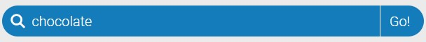
    
  - Users also have the option to search for post tags by prefixing their search with a hashtag ("#") 
    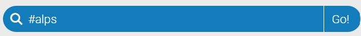
    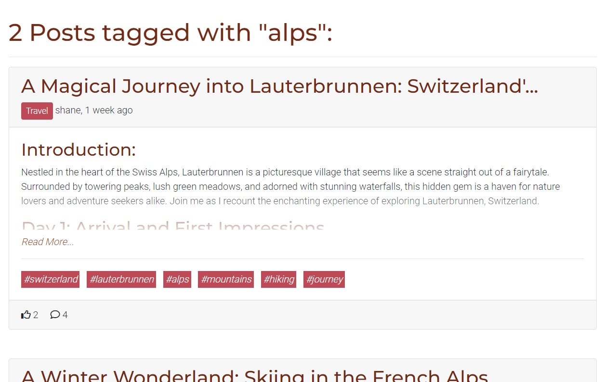
- **"My Posts"**
  - Users can easily jump to their created posts to monitor interactions by clicking on the "My Posts" button within the navigation
    
- **Filter Posts by Likes/Newest**
  - All of the above methods of finding posts can have the results of those queries sorted by "Popular" or "New", first displaying the posts with the highest number of likes or posts that were most recently created, respectively
    
    
- **Browse Polls**
  - Along with posts, users can also browse through and vote on polls, made easy through the use of the "Polls" navigation tab
  - Here, polls are divided into 3 categories:
    - *Open polls*, where users can engage with polls and contribute their opinion to the overall score
    - *Closed polls*, if the user feels like gathering information about votes that occured in the past
    - *"My polls"*, which is a place for the user to find the answers to all their asked questions 
  - Posts as part of polls are included, with a link to the post so the user can get the full context of the poll, as well as engage with the comments
  
  

## Design

### User Interface

<strong>The Login/Signup Page</strong>
<ul>
<li>This is where the site users begin their journey. Compared to the rest of the site, the layout for these pages is simple, with the Conversate brand logo on the left, the form to log in/sign up on the right, and a simple post footer at the bottom to mark the end of the page</li>
<li>For mobile devices, an orange navbar showing a minimized brand logo appears instead of the large logo, in order to confirm to the user that they are on the Conversate website</li>
<li>I wanted these pages to be minimalistic prevent any distractions from the main action of these pages, which is to log in/sign up to the website</li></ul>

<strong>Desktop</strong>

<strong>Mobile</strong>

<strong>The Main User Interface</strong>

Apart from the login and signup pages, all other pages use the same user interface to maintain consistency and prevent confusion among users when navigating the site

The user interface is made up of 2 components:<ul>
    <li><strong>The top navigation</strong>
    <ul>
        <li>This part holds the Converate brand logo on its left, a place where users would expect to find it</li>
        <li>Its main purpose is to contain the user action buttons, such as creating posts, creating polls and managing user settings. These are grouped together on the right hand side of the screen
        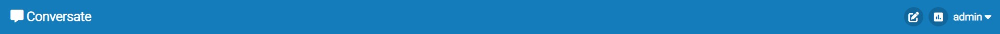</li>
        <li>If the user hovers over the create post or create poll icon, they will expand revealing a label that signifies their purpose. This helps new users in understanding the functions of these buttons 
        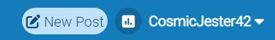</li>
    </ul></li>
    <li><strong>The side navigation</strong> 
    <ul>
        <li>This part is responsible for the site navigation. It includes a search bar, an option to sort posts by popular/new, and links to the home page, post categories, polls and user-owned posts 
        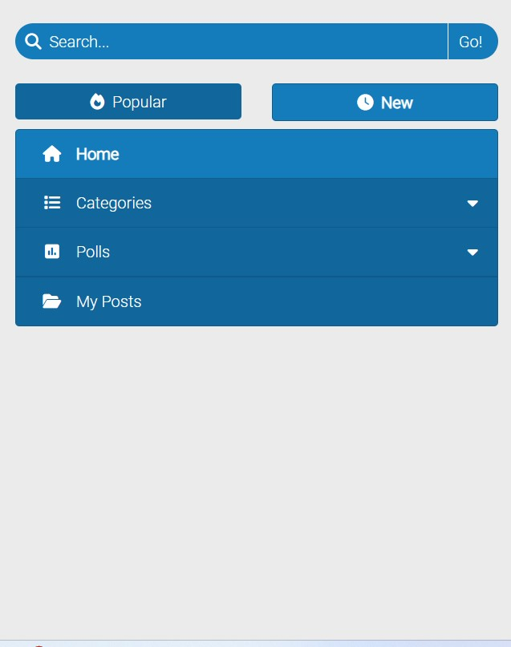</li>
    </ul></li>
    <li>For mobile screens, due to space constraints, the side navigation is hidden, and a collapse icon appears beside the logo. When clicked, this icon expands the side navigation over the main content, allowing it to be visible only when the user wants it to be 
    </li>
    <li>All components of the user interface have fixed positions, which gets rid of the annoyance of the user having to scroll to the top to continue to navigate the site 
    </li>
</ul>

<strong>The Search Bar</strong>
<ul>
    <li>The design of the search bar is nothing new, only consisting of a search text input and a button to trigger the search. Most users will recognise this layout and be able to use it intuitively 
    </li>
    <li>The search bar also has a function to search posts by tags by prefixing the search with a hashtag ("#"). This is explained to the user with a popup alert below the search bar when the user attempts to type something in it. This only appears once per session to prevent it from becoming an annoying popup 
    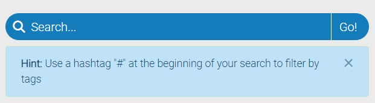</li>
</ul>

<strong>Content Navigation</strong>
<ul>
    <li>The content navigation buttons are prioritized by how much content they can present to the user, with the highest volume of posts (The home page, where you can find all posts) listed at the top, and the lowest volume of posts (Most likely the number of user-owned posts) at the bottom</li>
    <li>The page button that the user is currently on is colored in a slightly lighter tint than the rest of the buttons to make it easier for the user to tell what page they are on 
    </li>
</ul>

<strong>Post Sorting Buttons</strong>
<ul>
    <li>All searches for posts can be ordered by the highest number of votes or by most recently posted, with 2 buttons situated above the content navigation</li>
    <li>For consistency, the selected button is colored in the same manner as the selected tab 
    </li>
    <li>If the user is on a page where the post sorting buttons have no purpose, the buttons will disable, with a faded appearance and complete loss of interaction. I decided to keep the buttons there instead of removing them to maintain the consistent structure of the user interface 
    </li>
</ul>

<strong>New/Edit Post Pages</strong>
<ul>
    <li>The new/edit post consists of a list of inputs for customizing the properties of the post. They are stacked within a column, with the exception of the image inputs for larger screens, which sits on its own to the right. I find that compacting the information this way prevents the inputs from becoming oversized, leaving an excess of blank space across the page 
    </li>
    <li>For smaller screens, the image inputs are moved into the same column as the rest of the inputs, and the image preview and option to place the image are hidden if no image has been selected, and will reveal themselves if the user inputs an image. This saves the user from having to scroll through unnecessary content 
    </li>
    <li>For the same reasons, the poll inputs are only shown when the user has selected to include a poll in their post 
     </li>
    <li>These pages have had their enter key press customized to perform actions depending on what input the user is interacting with.
    <ul>
        <li>Pressing enter while focused on the tag input will add a tag to the list of existing tags, if valid</li>
        <li>Pressing enter while focused on the poll answer input will add the answer if it is valid</li>
        <li>Pressing enter in the body text editor will add a new paragraph</li>
        <li>Pressing enter for any other text input will make that input lose focus</li>
        <li>Pressing enter when no input is selected will attempt to submit the form</li>
    </ul>
    The default action of pressing enter attempts to press the first button it finds in the form, which can lead to unexpected results. Having custom behaviours can greatly improve the user experience, and can avoid any frustrations for accidentally submitting the form prematurely
    </li>
</ul>

<strong>Confirmation Modal</strong>
<ul>
    <li>When a user attempts to log out, edit or delete their account, or delete
    a post, comment or poll, a modal will appear, asking for confirmation that
    the user really wishes to perform this action. This is good practice to
    provide an extra safety barrier in case the user accidentally clicks one of
    these buttons 
    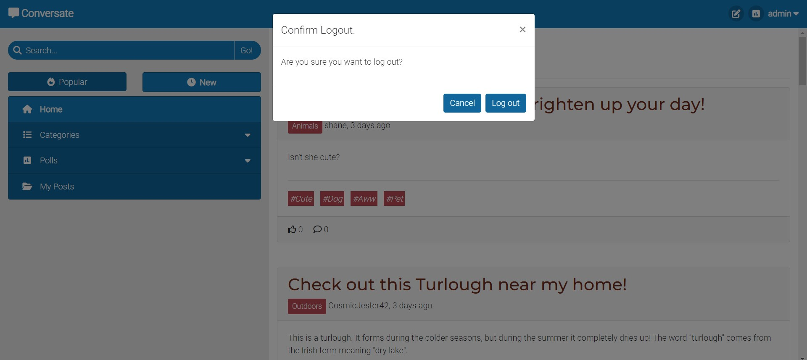</li>
    <li>For extra sensitive actions, such as editing/deleting the account, the
    modal is enforced with a password confirmation, to confirm the person
    attempting the action is the owner of the account 
    </li>
</ul>

<strong>Alerts</strong>
<ul>
    <li>Once a user performs an action, after the new page loads an alert
    message will pop at the beginning of the main content section, alerting the
    user if their action was successful or not</li>
    <li>Users can dismiss alerts by clicking on their close icon, or will be
    dismissed automatically after 5 seconds, so that the messages can get out
    of the way of the main content once it has served its purpose</li>
    <li>Successful alerts are green in color, and unsuccessful ones are red 
    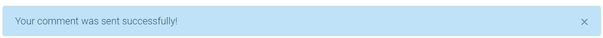</li>
    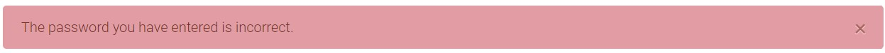</li>
</ul>

### Content Layout

<strong>Post Previews</strong>
<ul>
    <li>Post previews are made up of a header, main body and footer. They are a
    sample of a post aimed at giving the user a sneak peak of the full post,
    making them want to click on it to find out more or read the comments 
    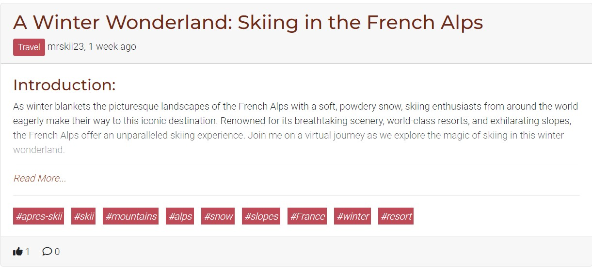</li>
    <li>The header is situated at the top of the preview, which is what the user
    would see first, so it is made up of the post's main details such as the
    title, category, user and time since posted</li>
    <li>If the title of the post is too long, a reduced version of it will be
    shown in the preview for space reduction 
    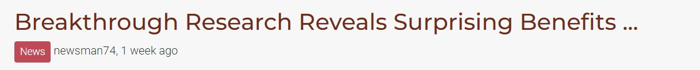</li>
    <li>The main body contains the post's main content and its tags. The post
    preview has a limited height to prevent a single post from taking up too
    much space, so if the content requires more space than given, the text will
    appear to fade out at the bottom, and an anchor labelled "Read More..." will
    also appear. This implies to the user that there is more to be seen within
    the full post, tempting them to click to find out more</li>
    <li>If the post has any tags, they will be shown just below the text body.
    These tags can emphasise keywords that may not be visible in the body
    preview, giving the user a more clear idea of the topic of the post without
    having to click to get an understanding. The user should click out of
    curiosity, not out of confusion!</li>
    <li>Images or polls are not shown in the preview because they could take up
    too much space on the screen, causing the user to have to scroll more
    through posts they may not like 
    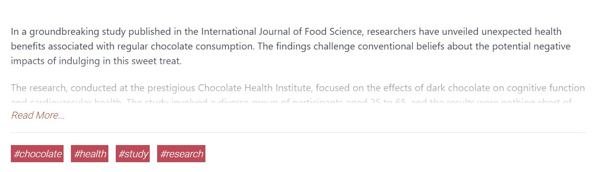</li>
    <li>The post footer rests at the end of the post, containing the post's
    number of likes and comments. If the user has got to this point without
    clicking, this is the last thing they see before moving on to the next post,
    so maybe seeing the level of interactivity happening with this post might
    convince them to click and see what the interactions are about 
    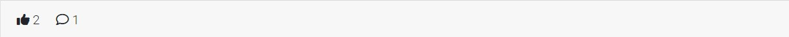</li>
</ul>

<strong>Post Details</strong>
<ul>
    <li>The post details page follows a near identical format to it's preview,
    but with the title and content's full context, as well as showing images,
    polls and comments</li>
    <li>Images can be placed either before or after the text body, giving the
    creative power to the user to decide what position workd best for their
    post 
    </li>
    <li>Polls, however, are always included at the bottom of the post. Polls
    attached to posts generally have something to do with the post itself, so
    it is better for the user to read the post to get a better understanding on
    the poll they are about to vote for 
    </li>
    <li>The post footer is almost the exact same as in the preview, with the
    exception of the date of posting at the right hand side, as well as the
    ability to interact with the like and comment buttons 
    </li>
    <li>If the user created the post, 2 extra buttons appear to edit or delete
    the post, giving the user full control over their posts even after creating
    them 
    </li>
</ul>

<strong>Comments</strong>
<ul>
    <li>Comments begin by stating the name of the user who posted it, and how
    long ago they posted it. I did this because I felt it's better to figure
    out the "Who" and the "When" before moving on to the "What" of the
    comment</li>
    <li>The comment footer uses the exact same structure as the post footer
    (except for the date), in order to have a consistent layout that is
    easier to follow 
    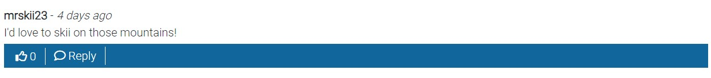</li>
    <li>Comments are ordered by newest first, so the freshest conversations
    are more likely to be seen 
    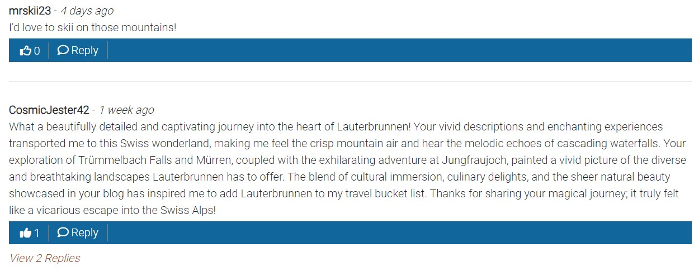</li>
    <li>Replies are grouped with the comment they are replying to, with the
    reply section required to be expanded, which neatly organizes comment
    conversations together without taking up too much space</li>
    <li>Replies are sorted by oldest first, so the conversation can be viewed
    in the order it happened 
    </li>
</ul>

<strong>Polls</strong>
<ul>
    <li>Polls are made up of a title/question, a set of up to 5 answers and a
    due date. They can have a post attached to them to add context and allow
    other users to like and comment on the poll 
    <li>Users can only see the results of a poll after they have voted or after
    the due date, so that the user isn't biased towards the most popular vote.
    For the same reason, users cannot change their vote once they make a
    decision 
    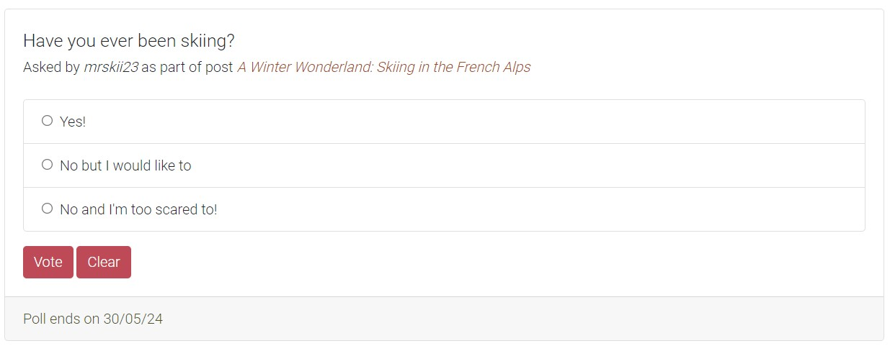</li>
    <li>Creators of the poll cannot edit them, to prevent making them look like
    people voted for something they didn't. If users want to change the poll,
    they can delete the poll and start a new one, allowing other users to
    change their vote accordingly 
    </li>
</ul>

### Color Scheme

I decided to use a 2-hue color scheme to design Conversate

- **Primary Color**: I chose to use a *red-orange* hue as the primary color. This hue is used mostly to decorate the user interface and headings, so it covers a significant portion of the page. I decided on this because orange is often associated with warmth, positivity, sociability and creativity, all of which are important emotions we want the users to feel in order to be encouraged to interact with the community and create content. 

- **Secondary Color**: I decided on using a *light green* hue as my secondary color. This color's main purpose is to draw attention to whatever is colored by it, so it is used to color buttons and links. Posts in the post list page also use this color, but as a lighter, less saturated form in order to not be too overpowering 

I find these two colors compliment each other very well. They look good together, while at the same time being distinct from each other. The green color draws your attention from the orange, which helps guide you through the site in the direction it wants you to go

### Typography

Conversate's text is made up of 2 separate fonts:

- **Montserrat**: This font is used for all headings 
  
- **Roboto**: This font is used for all other types of text 
  

I chose to use these fonts simply because they are easy to read, and work well
with the feel and color scheme selected for the site

### Wireframes

#### Desktop

Login Page

Signup Page

Home Page (Post List)

Post Details Page

  
  

New/Edit Post Pages

  
  

New Poll Page

Poll List Page

Category List Page

Account Settings Page

#### Mobile

Login Page

Signup Page

Home Page (Post List)

Post Details Page

  
  

New/Edit Post Pages

  
  

New Poll Page

Poll List Page

Category List Page

Account Settings Page

## Agile Methodologies

This website was completed using an agile development system.

- Each feature was broken down into user stories, which are comprised of the following:
  - A set of acceptance criteria to know when the feature is complete
  - Tasks to achieve in order to implement it
  - Story points to give an estimate on how long it will take to complete.
  - An epic which groups similar user stories together

- Once finalized, these user stories were transferred to the product backlog, which was where all incomplete user stories that were not being worked on were kept.

- The work done was divided into week-long iterations, with a total of 7 iterations occuring to implement all the features in the website.
  - For each iteration, I added a set of user stories which I was to complete within the week, taken from the product backlog, with the aim of having the total story point number resting between 8 and 10 story points
  - Each user story was given a label:
    - "Must Have", given to user stories that must be completed within the iteration timeframe
    - "Should Have", given to user stories that don't have to be completed for this iteration, but should if possible
    - "Could Have", which are user stories that can be completed if all other user stories are finished
  - For each iteration, no more than 60% of all of its user stories were labelled with "Should have"
  - If user stories were still remaining once an iteration came to a close, they were returned to the product backlog, where they could be selected for future iterations

## Data Models

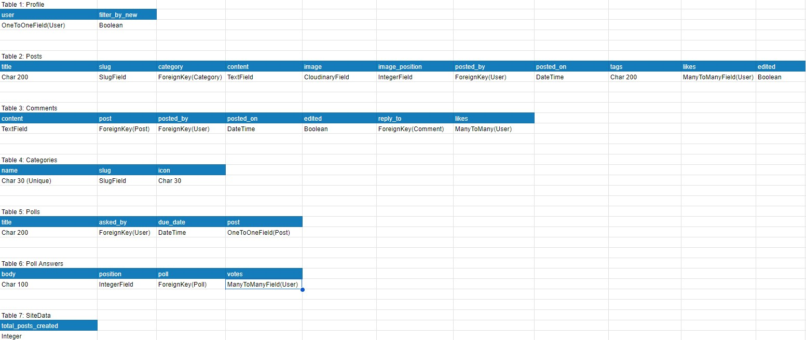

### CRUD Functionality

#### Profile

- **Create**: The Profile model is created when a user creates an account. It
is used to store extra information about a user, currently only storing a single
boolean value, sort_by_new. This stores the post order preference of the user so
they do not have to keep setting their preference when entering the site
- **Read**: It's value is read every time a page with a list of posts is
loaded, checking the user's preference and ordering the posts according to what
has been selected
- **Update**: Every time the user clicks one of the post sorting buttons
above the post navigation links, the page will refresh, update the sort_by_new
value and order the posts by this new value
- **Delete**: The Profile object is deleted when a user deletes their account

#### Post

- **Create**: Users can create a post in the "Create Post" page. If an image is
included in the post, it is uploaded to Cloudinary
- **Read**
  - The post can be queried in a post list and displayed as a preview
 along with other posts, where all fields, except the image, comments and poll,
 can be seen.
  - If the user clicks on this preview, the full post is shown with all fields
in the model being put to use
- **Update**
  - Users can find a button in the footer of their own posts to edit
that post.
  - Once the user successfully edits a post, the "edited" boolean field
is set to "True"
  - If the image is updated, the old image is deleted from Cloudinary before the
new one takes its place
  - In the "Post Edit" page, the user can remove an image by clicking the delete
icon in the top-right corner of the image container. This will remove the image
from Cloudinary without having to save the edit
- **Delete**
  - Beside the post edit button, there is another button to delete the post.
After confirming the delete, the post will be removed, and the image will be
removed from Cloudinary
  - If the user deletes their account, all posts belonging to them will be
deleted, and all images will be removed from Cloudinary

#### Comment

- **Create**: Comments can be created in the comments section of a post, by
either the comment input underneath the post, or under a comment for a reply 
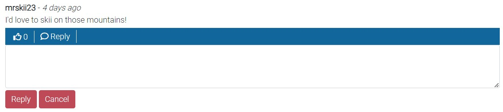
- **Read**: Comments are loaded with the post they are commented on, and can be
found at the bottom of the page
- **Update**: Users can find the edit comment button in the comment footer. The
comment is then replaced by a textarea input prepopulated with the original
comment 

- **Delete**: Situated beside the edit button, the user can also delete the
comment. If the user or post is deleted, the comment will be deleted as a
result

#### Category

Users do not have permission to create categories. They must be created by
admins, so I decided to not implement CRUD functionality without the admin panel
for this model.

#### Poll

- **Create**: Polls can be created in the "New Poll" page, or as part of a post
in the "New Post" page
- **Read**: Polls can be found in the "Poll" tab group in the side navigation,
or at the bottom of the post it is attached to
- **Update**
  - In order to make polls as legitimate and fair as possible, the
poll title and answers cannot be edited. This prevents users from manipulating
the question or answers to make the poll mean something different than what the
voters have voted for
  - However, what won't affect the results is the due date. Users are allowed to
change the due date even if the poll has already ended
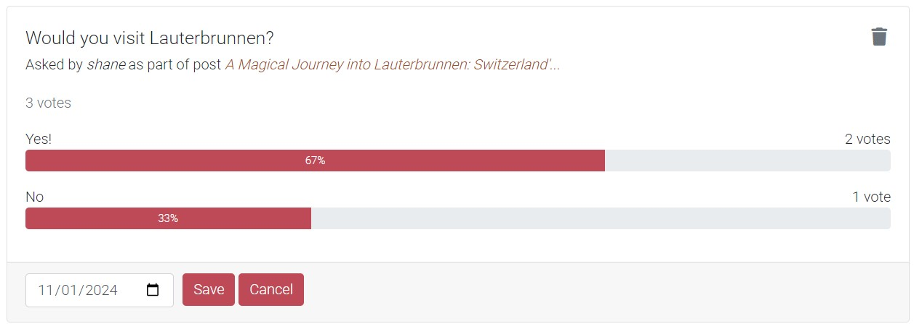
- **Delete**: Polls can be deleted by the user by clicking on the trash icon on
the top-right corner of the poll. If the user or post it belongs to is deleted,
the poll will be deleted as well

#### PollAnswer

- **Create**: For each answer the user enters when creating a poll, a poll
answer is created. I decided to do it this way so that the number of answers for
a poll can be customized, with the number stored as the constant "maxAnswers" in
the "polls.js" file
- **Read**: These answers are loaded by their polls and used for radio inputs
for the user to select their answer
- **Update**: Like the poll, the body of these answers cannot be changed to keep
the poll fair, However, when the user casts a vote, they are added to the
selected poll answer's "votes" value
- **Delete**: Answers can only be deleted when the poll they belong to is
deleted

#### SiteData

- **Create**: Only one item exists in this model, which is used for any
variables the site needs to store. Currently it only stores the number of posts
created
- **Read**: Every time a post is created, the total_posts_created value is read
and converted into a customized miniature UUID, used to generate a part of the
post's slug
- **Update**: When this value is read, the number_of_posts value is increased
by 1
- **Delete**: The item in this model should not be deleted, but if it is, a new
one will be created when the data is requested, setting the value of
total_posts_created to 0

## Testing

### Bugs

- **Tags disappear after post edit**
  - *Expected result*: All previously entered tags should remain if kept by the
user
  - *Solution*: The hidden input used to store the tags did not have its value
set to the original list of tags on page load, so if the user updates the post
without editing the tags, the tag data is lost. To fix, set this input's value
to the post's tags
- **Clicking on the poll checkbox collapse again during the collapse animation**
**will cause the collapse and the checkbox to become out of sync**
  - *Expected result*: If the checkbox is checked, the poll collapse should be
shown, and vice versa
  - *Solution*: Once the collapse animation is finished, the checkbox is checked
again, and if the checkbox and collapse are out of sync then the collapse is
updated again to synchronize them once again
- **Images remain on Cloudinary if the user deletes their account without**
**deleting their posts first**
  - *Expected result*: If the user deletes their account, all their posts, and
their images along with it, should be deleted, as leaving them could cause a
data overflow on Cloudinary
  - *Solution*: If a user deletes their account, before the deletion, iterate
through all their posts and delete the images individually
- **Body text of post is sometimes deleted after editing a post**
  - *Expected result*: The body text of the post should always save with what is
in the text editor
  - *Solution*: Summernote does not update its value unless the user clicks into
it, so if the user edits the post without changing the content, the body input
will be left blank. The solution I came up with was to store the original text
in a hidden input, and if the body text is found to be blank on submission, set
the text value to this input
- **Image position moves to top of post after editing the post**
  - *Expected result*: Image should stay in the position it was set to be in
  - *Solution*: On the edit post page, the select input was always set to
"Top of page", despite what the user had previously entered, so if the post
were to be edited without altering this input, it would default to the top of
the page. To fix this, add an if statement in the edit_post template to update
the select input depending on what the original image_position is

### Manual Testing

Manual testing can be found [here](TESTING.md)

### Automated Testing

#### Unittest

Unittest was used to test the following Python files:

<strong>slug.py</strong>

This file contains the functions responsible for handling
slug creation. It consists of the following functions:<ul>
<li><strong>generate_slug</strong>: This function generates a unique slug for
each post, giving the ability for multiple posts with the same title to coexist.
It takes the title of the post and the slug of the post's category as
parameters. It does so by starting the slug with "(category_slug)-". It then
sets the random seed to the total number of posts on the site, and generates 8
random characters (digits or letters) using that seed. Finally, it will add the
title, which will be converted to a slug-friendly format, to the end of the
slug. 
The rules I tested for this function are as follows:<ul>
    <li>The "title" parameter must be a string</li>
    <li>The "category_slug" parameter must be a string</li>
    <li>The function returns a string</li>
    <li>A set of 8 randomly generated characters is present in the output (This
could be tested because the random numbers are seeded, so will always return
"SoMUq2gZ" for seed 0)</li>
    <li>The category slug is present in the output</li>
    <li>A slugified version of the title input is present within the slug 
</li>
<li>This function contains also updates the SiteData Django model to add 1 to
its total number of posts. This cannot be tested using unittest, as it requires
Django configuration, but was tested manually to confirm it works. The automated
test on this function was run without this code snippet and produced positive
results</li>
</ul></li>
<li><strong>generate_character_set</strong>: This function returns a sequence of
random characters as a string. It takes in 2 parameters, the seed for random
generation and the amount of characters that will exist in the string 
The rules I tested for this function are as follows:<ul>
    <li>The "seed" parameter must be an integer</li>
    <li>The "number_of_characters" parameter must be an integer</li>
    <li>number_of_characters must be between 1 and 100 (negative seed numbers
is fine)</li>
    <li>The function returns a variable of type "string"</li>
    <li>The length of the string equals the number_of_characters parameter</li>
    <li>The output is consistent with the seed input (seed 0 always gives
"SoMUq2gZ", seed 100 gives "9ttYNbJp") 
</li>
</ul></li>
<li><strong>get_character</strong>: This function takes in an index as a
parameter and returns a specific character that has that index. 
The rules I tested for this function are as follows:<ul>
    <li>"index" parameter must be an integer</li>
    <li>index must be between 0 and 61</li>
    <li>The function returns a variable of type "string"</li>
    <li>An index value of less than 10 returns a set number character</li>
    <li>An index value between 10 and 35 returns a set lowercase letter</li>
    <li>An index value between 36 and 61 returns a set uppercase letter 
</li>
</ul></li>
<li><strong>format_tag_search</strong>: This function takes in a query entered
by the user in the search bar and converts it into a useable URL, removing all
special characters besides the allowed "_" and "-", and replaces any spaces with
a "+" symbol 
The rules I tested for this function are as follows:<ul>
    <li>The "tag_list" parameter must be a string</li>
    <li>The function returns a variable of type "string"</li>
    <li>The output removes any special characters from the input</li>
    <li>The output keeps underscores "_" in the input</li>
    <li>The output keeps dashes "-" in the input</li>
    <li>The output replaces spaces " " with pluses "+" in the input 
</li>
</ul></li>
<li>All tests have passed on running the test file (after removing the model
SiteData and all its references) 
</li>
</ul>

<strong>pagination.py</strong>

This file is responsible for creating a list of page numbers for the pagination
bar. Only a limited number of pages can be displayed, so the first page, last
page and all pages within a specified radius of the current page is shown. 
It contains only one function that was tested automatically:<ul>
<li><strong>get_page_range</strong>: This function returns an object containing
the range of numbers with the current page in the middle and has a length of the
constant MAX_PAGES - 2 (The 2 missing is for the first and last page). For
example, a current page of 24 with a MAX_PAGES of 9 will produce
[20, 21, 23, 24, 25, 26, 27] 
The rules I tested for this function are as follows:<ul>
    <li>The "page_index" parameter must be an integer</li>
    <li>The "last_page" parameter must be an integer</li>
    <li>The "num_pages" parameter must be an integer</li>
    <li>The "page_index" parameter must be between 1 and the "last_page"
parameter</li>
    <li>"last_page" cannot be less than "num_pages"</li>
    <li>"num_pages" cannot be less than 1</li>
    <li>"num_pages" must be an odd number (to allow the current page to be in
the middle)</li>
    <li>The "page_range" key of the object output must have a length of
"num_pages"</li>
    <li>If the current page is not at the beginning or end of the list of pages,
then it sits directly in the middle of the list of pages</li>
    <li>The list of pages always includes the first page</li>
    <li>The list of pages always includes the last page</li>
    <li>If there is a gap between the first page and the group of pages
surrounding the current one, the returned key of "start_gap" must be True</li>
    <li>If there isn't a gap, the returned key of "start_gap" must be False</li>
    <li>If there is a gap between the last page and the group of pages
surrounding the current one, the returned key of "end_gap" must be True</li>
    <li>If there isn't a gap, the returned key of "end_gap" must be False 
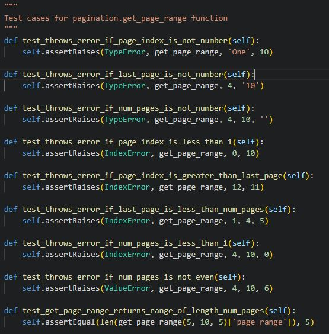
</li>
</ul></li>
<li>All tests have passed on running the test file 
</li>
</ul>

I used the Red, Green, Refactor (RGR) method to implement these test cases. This
involves creating a test case that is known to fail:

Then, the bare minimum amount of code is written to make the test pass:

And finally, where applicable, the code is refactored to make it more clean and
reuseable, and the cycle of the test starts again. The benefir of using this
system is that once the code has been completed, there is no need to manually
test it afterwards, as all test cases have already been accounted for

#### Jest

All of my JavaScript files involve manipulating the DOM, so I decided that
using the DOM to test my scripts instead of using Jest's mocking function was
more efficient. See the [manual testing segment](TESTING.md) to see more about
JavaScript testing

### Browser Testing

- Google Chrome: Conversate was developed using Google Chrome, and all manual
testing was done on this browser, with no issues detected
- Microsoft Edge: Conversate was tested on Microsoft Edge with no issues. The
design, functionality, animations and responsiveness remains the exact same as
Google Chrome
- Firefox: After testing Conversate on Firefox, the only difference I found is
that the bold text in the navigation bar looks slightly wider than on Edge and
Chrome. This is merely cosmetic so I don't find any issue with this

Logo on Chrome:

Logo on Firefox:

### Known Issues/Unfixed Bugs

## Validation

### W3C HTML

### W3C CSS

### JSHint

### PEP8

### Lighthouse Page Loading

### WebAIM Color Contrast

## Deployment and Local Development

### Deployment to Heroku

### Cloning Repositories

### Forking Repositories

## Credits

### Libraries/Tutorials

### Media

- Conversate was made using the [Django Framework](https://www.djangoproject.com/)
- The site was styled with the help of [Bootstrap](https://getbootstrap.com/)
- The [Django Summernote text editor](https://github.com/summernote/django-summernote)
was used for the post body input
- Content used to populate the site was generated by [ChatGPT](https://chat.openai.com/)
- Color scheme was decided with the assistance of [Colormind](http://colormind.io/)
