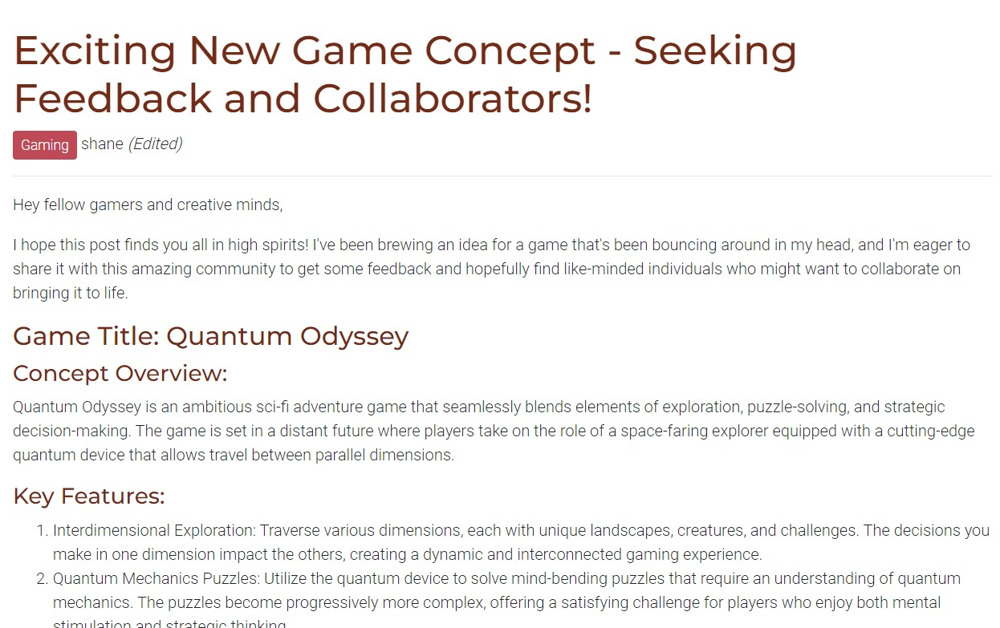
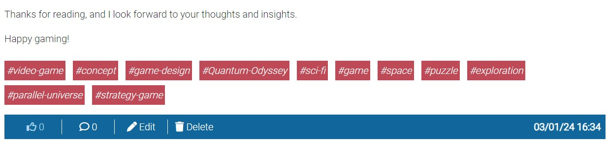
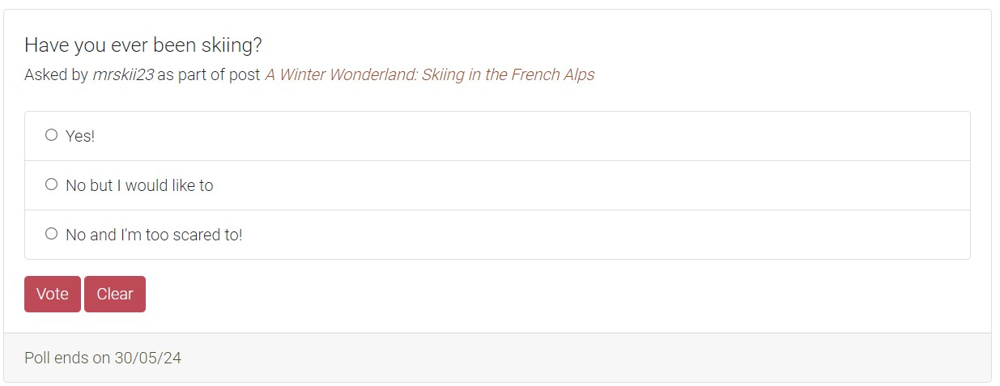
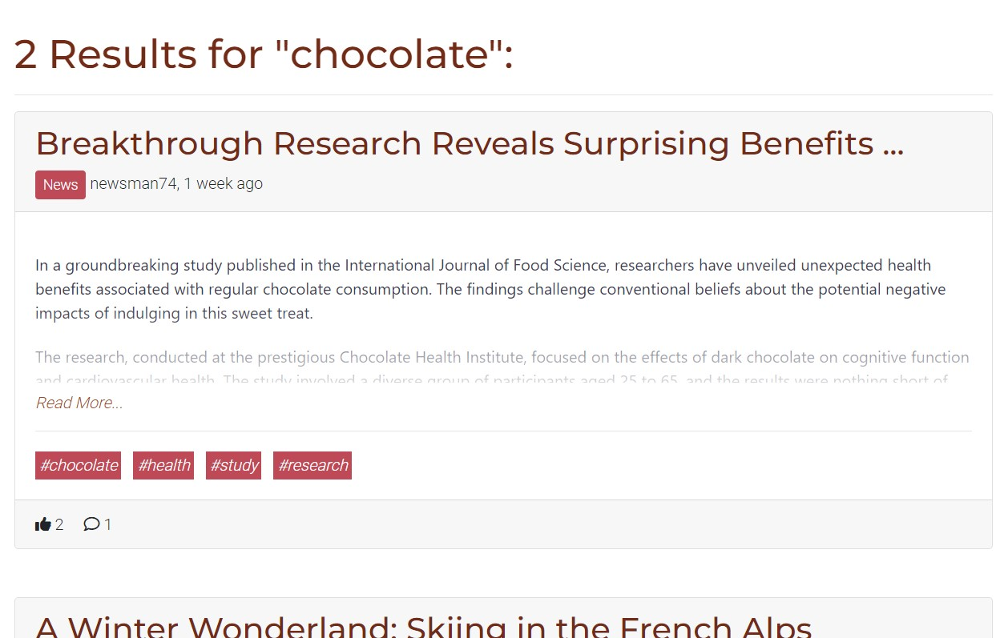
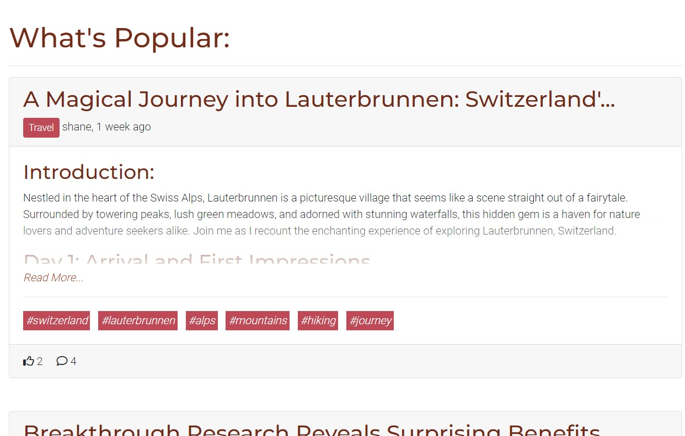
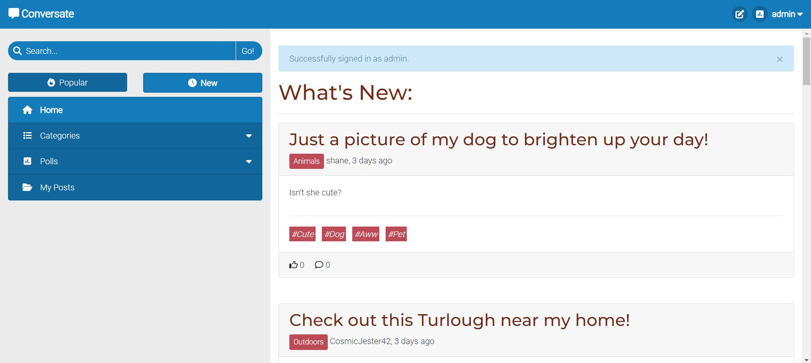
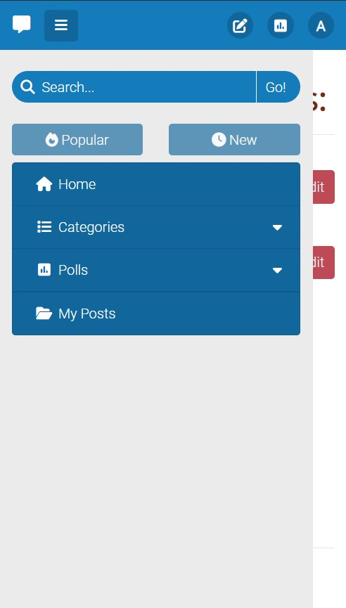
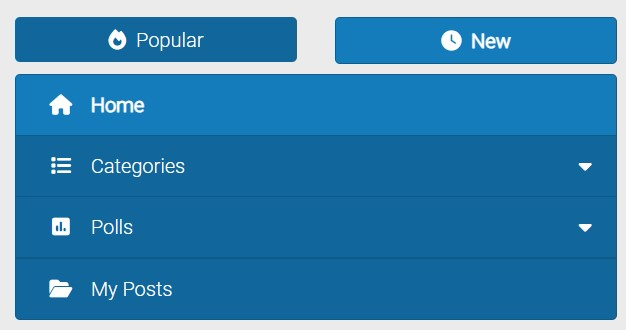
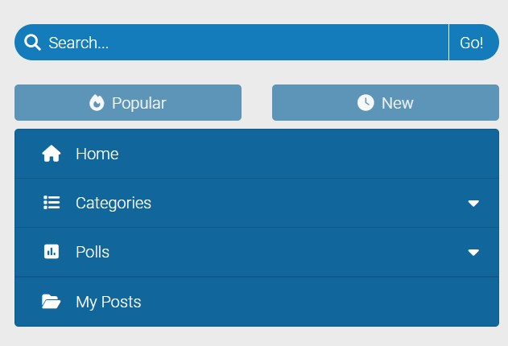
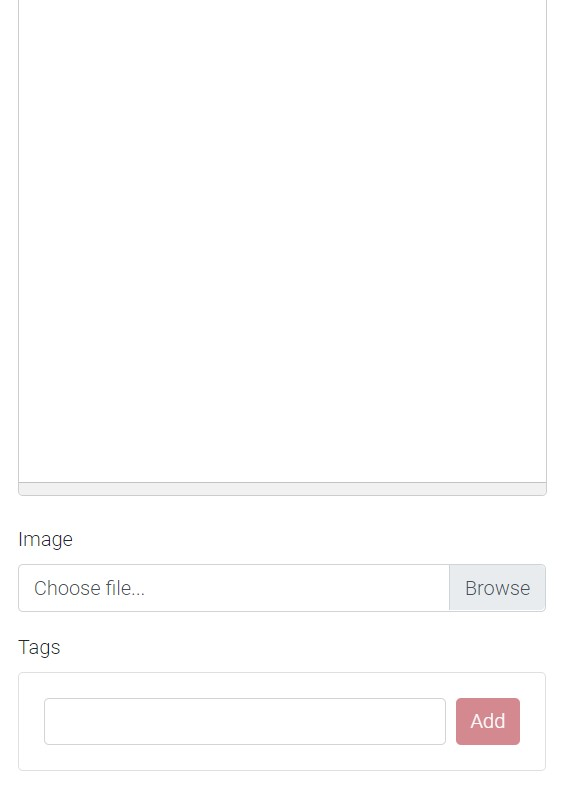

# Conversate&#46;com

## Introduction

Conversate&#46;com is a forum website where people can connect with each other by writing posts, uploading images and creating polls for other people to vote on. The aim of this website is to provide a platform that gives its users a wide range of ways to express their thoughts and opinions, as well as making those expressions as accessible to other users as possible. Conversate was made using the Django framework and designed using Bootstrap

## Design Thinking Process

> *"Why would a user want to visit our website?"*

- To discover information easily and efficiently
- To share their information with the world
- To interact with a community that relates to them

> *"How do we want our users to feel while using our website?"*

- Encouraged to interact with the community

### Problem Statement

> *"How can we make information easy to share and access for everyone?"*

### Solutions

> *"Why would a user want to visit our website?"*

- **To discover information easily and efficiently**
  - Upon logging in to the site, users are introduced to the site's home page, where they can explore a wide range of posts the site has to offer. Having every kind of post available on the home page can help newcomers who are unsure about what they are looking for discover the kind of content that best suits them.
  - If users are looking for something a little more specific, they have an option to search for posts using keywords.
  - Posts can be sorted by "Popular" (Highest number of likes) or "New" (Most recently posted)
- **To share their information with the world**
  - Users can create posts, upload images and ask questions through the use of polls.
  - Posts can be customized using a wide selection of styles, allowing the creators to add headings, divide their content into paragraphs, include lists and tables, and add links to other pages.
- **To interact with a community that relates to them**
  - Posts can have a category assigned to them. Users that are searching for a particular type of post can explore these categories and discover a community that is also interested in this topic.

> *"How do we want our users to feel while using our website?"*

- **Encouraged to interact with the community**
  - Users are required to be logged in to navigate through the majority of the website, which means if they discover a post that interests them they will always have the opportunity to like and comment on that post, as well as vote in polls they discover.

## Features

- **Posts**
  - Posts are the main attraction to Conversate. They are blocks of text created by users to send their thoughts out to the world for all to see. 
    
  - All posts are made up of a title and a main body of text. The site uses Summernote's text editor to give users the ability to add style to their posts. They can add headings, paragraphs, bullet points, links, tables and horizontal rules. Text can also be styled in a number of ways, including changing the font size and setting the font to bold, italics or underlined
     
  - Categories can be added to a post in order to group it with other posts of a similar nature. There are a selection of categories created by the site administrators that can be chosen from
  - Images can also be added to a post. A picture is worth a thousand words, so adding one can add an invaluable layer of depth to the story the poster is trying to tell. Images can be placed above or below the main body of text 
    
  - Posts can be tagged with a list of keywords. These tags can be clicked on, revealing all posts that also have this tag. Using hashtags can increase the likelihood of the post to be seen, as it provides an extra method for posts to be queried
  - Users can choose to like posts to show appreciation to the poster. Posts with more likes are more likely to be found by exploring users. Posters cannot like their own posts
    
- **Comments**
  - Users can comment on posts to share thoughts or add insight of their own
  - If a user sees a comment they appreciate, they can like that comment
    
  - Comments can also be replied to so that a conversation can be started with the commenter. Replies can be replied to in a similar manner
    
- **Polls**
  - Polls are an excellent way to collect answers and gather statistics from the site's community. They are made up of a question (title), a list of between 2 and 5 answers, and an end date.
    
  - Polls can be included within a post, giving the user the ability to add more context to the poll, as well as allowing people to respond in the comments
    
  - Users can only vote for one answer in the list, and once they vote on their decision, they are unable to change their vote
  - Answers from other users cannot be seen until the user has voted, in order to prevent people from only selecting the most popular vote
    
  - Once a poll has passed its due date, votes will no longer be accepted and the final results will be shown
    
- **The Home Page**
  - When the user first logs in to Conversate, the home page is the first step on their journey.
  - They are welcomed with any possible kind of post made, allowing them to explore a wide variety of content until they find something that interests them.
    
- **Categories**
  - If users are looking for something a little more specific, they can search for posts by what category they belong to.
  - A list of categories is present within the navigation that shows the categories with the most posts, making more content easily available to the user
    
    
- **Search Posts**
  - For users that are specifically looking for posts that contain certain words or phrases, they can use the search bar and find those posts
    
    
  - Users also have the option to search for post tags by prefixing their search with a hashtag ("#") 
    
    
- **"My Posts"**
  - Users can easily jump to their created posts to monitor interactions by clicking on the "My Posts" button within the navigation
    
- **Filter Posts by Likes/Newest**
  - All of the above methods of finding posts can have the results of those queries sorted by "Popular" or "New", first displaying the posts with the highest number of likes or posts that were most recently created, respectively
    
    
- **Browse Polls**
  - Along with posts, users can also browse through and vote on polls, made easy through the use of the "Polls" navigation tab
  - Here, polls are divided into 3 categories:
    - *Open polls*, where users can engage with polls and contribute their opinion to the overall score
    - *Closed polls*, if the user feels like gathering information about votes that occured in the past
    - *"My polls"*, which is a place for the user to find the answers to all their asked questions 
  - Posts as part of polls are included, with a link to the post so the user can get the full context of the poll, as well as engage with the comments
  
  

## Design

### User Interface

<strong>The Login/Signup Page</strong>
<ul>
<li>This is where the site users begin their journey. Compared to the rest of the site, the layout for these pages is simple, with the Conversate brand logo on the left, the form to log in/sign up on the right, and a simple post footer at the bottom to mark the end of the page</li>
<li>For mobile devices, an orange navbar showing a minimized brand logo appears instead of the large logo, in order to confirm to the user that they are on the Conversate website</li>
<li>I wanted these pages to be minimalistic prevent any distractions from the main action of these pages, which is to log in/sign up to the website</li></ul>

<strong>Desktop</strong>

<strong>Mobile</strong>

<strong>The Main User Interface</strong>

Apart from the login and signup pages, all other pages use the same user interface to maintain consistency and prevent confusion among users when navigating the site

The user interface is made up of 2 components:<ul>
    <li><strong>The top navigation</strong>
    <ul>
        <li>This part holds the Converate brand logo on its left, a place where users would expect to find it</li>
        <li>Its main purpose is to contain the user action buttons, such as creating posts, creating polls and managing user settings. These are grouped together on the right hand side of the screen
        </li>
        <li>If the user hovers over the create post or create poll icon, they will expand revealing a label that signifies their purpose. This helps new users in understanding the functions of these buttons 
        </li>
    </ul></li>
    <li><strong>The side navigation</strong> 
    <ul>
        <li>This part is responsible for the site navigation. It includes a search bar, an option to sort posts by popular/new, and links to the home page, post categories, polls and user-owned posts 
        </li>
    </ul></li>
    <li>For mobile screens, due to space constraints, the side navigation is hidden, and a collapse icon appears beside the logo. When clicked, this icon expands the side navigation over the main content, allowing it to be visible only when the user wants it to be 
    </li>
    <li>All components of the user interface have fixed positions, which gets rid of the annoyance of the user having to scroll to the top to continue to navigate the site 
    </li>
</ul>

<strong>The Search Bar</strong>
<ul>
    <li>The design of the search bar is nothing new, only consisting of a search text input and a button to trigger the search. Most users will recognise this layout and be able to use it intuitively 
    </li>
    <li>The search bar also has a function to search posts by tags by prefixing the search with a hashtag ("#"). This is explained to the user with a popup alert below the search bar when the user attempts to type something in it. This only appears once per session to prevent it from becoming an annoying popup 
    </li>
</ul>

<strong>Content Navigation</strong>
<ul>
    <li>The content navigation buttons are prioritized by how much content they can present to the user, with the highest volume of posts (The home page, where you can find all posts) listed at the top, and the lowest volume of posts (Most likely the number of user-owned posts) at the bottom</li>
    <li>The page button that the user is currently on is colored in a slightly lighter tint than the rest of the buttons to make it easier for the user to tell what page they are on 
    </li>
</ul>

<strong>Post Sorting Buttons</strong>
<ul>
    <li>All searches for posts can be ordered by the highest number of votes or by most recently posted, with 2 buttons situated above the content navigation</li>
    <li>For consistency, the selected button is colored in the same manner as the selected tab 
    </li>
    <li>If the user is on a page where the post sorting buttons have no purpose, the buttons will disable, with a faded appearance and complete loss of interaction. I decided to keep the buttons there instead of removing them to maintain the consistent structure of the user interface 
    </li>
</ul>

<strong>New/Edit Post Pages</strong>
<ul>
    <li>The new/edit post consists of a list of inputs for customizing the properties of the post. They are stacked within a column, with the exception of the image inputs for larger screens, which sits on its own to the right. I find that compacting the information this way prevents the inputs from becoming oversized, leaving an excess of blank space across the page 
    </li>
    <li>For smaller screens, the image inputs are moved into the same column as the rest of the inputs, and the image preview and option to place the image are hidden if no image has been selected, and will reveal themselves if the user inputs an image. This saves the user from having to scroll through unnecessary content 
    </li>
    <li>For the same reasons, the poll inputs are only shown when the user has selected to include a poll in their post 
     </li>
    <li>These pages have had their enter key press customized to perform actions depending on what input the user is interacting with.
    <ul>
        <li>Pressing enter while focused on the tag input will add a tag to the list of existing tags, if valid</li>
        <li>Pressing enter while focused on the poll answer input will add the answer if it is valid</li>
        <li>Pressing enter in the body text editor will add a new paragraph</li>
        <li>Pressing enter for any other text input will make that input lose focus</li>
        <li>Pressing enter when no input is selected will attempt to submit the form</li>
    </ul>
    The default action of pressing enter attempts to press the first button it finds in the form, which can lead to unexpected results. Having custom behaviours can greatly improve the user experience, and can avoid any frustrations for accidentally submitting the form prematurely
    </li>
</ul>

### Content Layout

<strong>Post Lists</strong>
<ul>
</ul>

### Color Scheme

I decided to use a 2-hue color scheme to design Conversate

- **Primary Color**: I chose to use a *red-orange* hue as the primary color. This hue is used mostly to decorate the user interface and headings, so it covers a significant portion of the page. I decided on this because orange is often associated with warmth, positivity, sociability and creativity, all of which are important emotions we want the users to feel in order to be encouraged to interact with the community and create content. 

- **Secondary Color**: I decided on using a *light green* hue as my secondary color. This color's main purpose is to draw attention to whatever is colored by it, so it is used to color buttons and links. Posts in the post list page also use this color, but as a lighter, less saturated form in order to not be too overpowering 

I find these two colors compliment each other very well. They look good together, while at the same time being distinct from each other. The green color draws your attention from the orange, which helps guide you through the site in the direction it wants you to go

### Typography

Conversate's text is made up of 2 separate fonts:

- **Montserrat**: This font is used for all headings 
  
- **Roboto**: This font is used for all other types of text 
  

I chose to use these fonts simply because they are easy to read, and work well with the feel and color scheme selected for the site

### Wireframes

#### Desktop

Login Page

Signup Page

Home Page (Post List)

Post Details Page

  
  

New/Edit Post Pages

  
  

New Poll Page

Poll List Page

Category List Page

Account Settings Page

#### Mobile

Login Page

Signup Page

Home Page (Post List)

Post Details Page

  
  

New/Edit Post Pages

  
  

New Poll Page

Poll List Page

Category List Page

Account Settings Page

## Agile Methodologies

This website was completed using an agile development system.

- Each feature was broken down into user stories, which are comprised of the following:
  - A set of acceptance criteria to know when the feature is complete
  - Tasks to achieve in order to implement it
  - Story points to give an estimate on how long it will take to complete.
  - An epic which groups similar user stories together

- Once finalized, these user stories were transferred to the product backlog, which was where all incomplete user stories that were not being worked on were kept.

- The work done was divided into week-long iterations, with a total of 7 iterations occuring to implement all the features in the website.
  - For each iteration, I added a set of user stories which I was to complete within the week, taken from the product backlog, with the aim of having the total story point number resting between 8 and 10 story points
  - Each user story was given a label:
    - "Must Have", given to user stories that must be completed within the iteration timeframe
    - "Should Have", given to user stories that don't have to be completed for this iteration, but should if possible
    - "Could Have", which are user stories that can be completed if all other user stories are finished
  - For each iteration, no more than 60% of all of its user stories were labelled with "Should have"
  - If user stories were still remaining once an iteration came to a close, they were returned to the product backlog, where they could be selected for future iterations

## Data Models

### CRUD Functionality

## Testing

### Bugs

### Manual Testing

### Automated Testing

### Browser Testing

### Known Issues/Unfixed Bugs

## Validation

### W3C HTML

### W3C CSS

### JSHint

### PEP8

### Lighthouse Page Loading

### WebAIM Color Contrast

## Deployment and Local Development

### Deployment to Heroku

### Cloning Repositories

### Forking Repositories

## Credits

### Libraries/Tutorials

### Media

- Conversate was made using the [Django Framework](https://www.djangoproject.com/)
- The site was styled with the help of [Bootstrap](https://getbootstrap.com/)
- The [Django Summernote text editor](https://github.com/summernote/django-summernote) was used for the post body input
- Content used to populate the site was generated by [ChatGPT](https://chat.openai.com/)
- Color scheme was decided with the assistance of [Colormind](http://colormind.io/)
